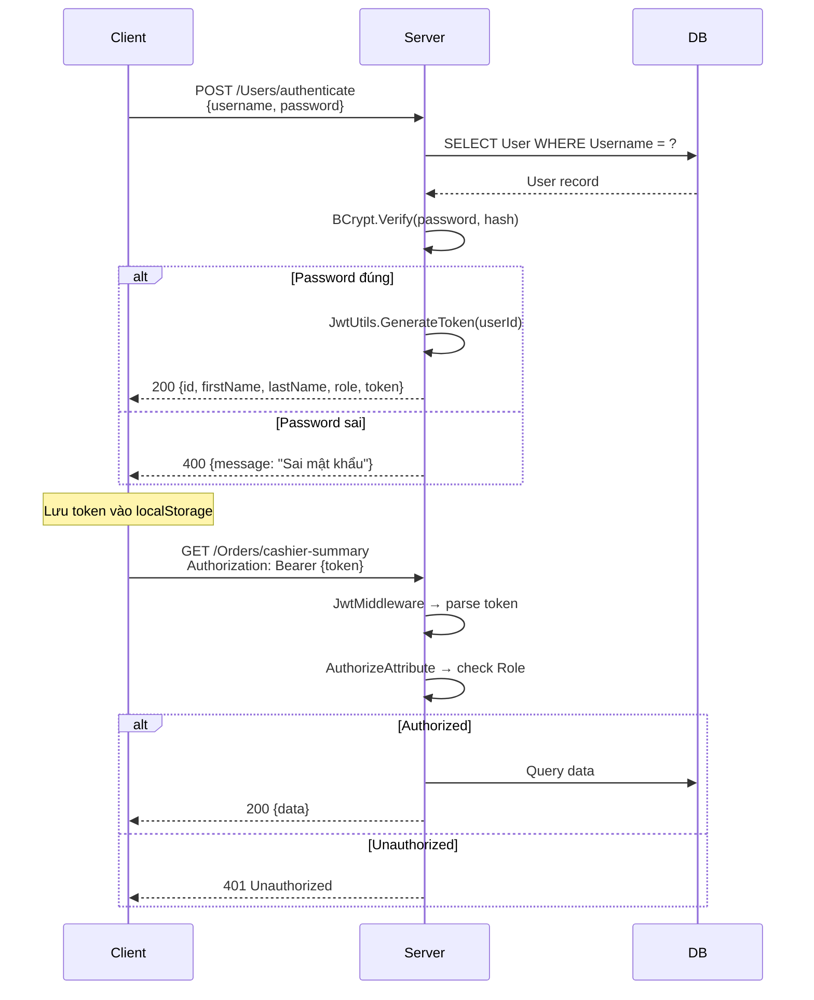

# 🗺️ API Reference — Cafe 24/7

## Tổng Quan

- **Base URL**: `http://localhost:{port}`
- **Authentication**: JWT Bearer Token (trừ các endpoint `[AllowAnonymous]`)
- **Response Format**: JSON
- **Error Format**: `{ "message": "Mô tả lỗi" }`

---

## 1. Authentication (`/Users`)

| Method | Endpoint | Auth | Mô tả |
|--------|----------|------|-------|
| `POST` | `/Users/authenticate` | ❌ | Đăng nhập, trả về JWT token |
| `GET` | `/Users` | Manager | Lấy danh sách tất cả users |
| `GET` | `/Users/{id}` | ✅ | Lấy thông tin user theo ID |
| `POST` | `/Users/register` | Manager | Tạo tài khoản mới |
| `PUT` | `/Users/{id}` | Manager | Cập nhật thông tin user |
| `DELETE` | `/Users/{id}` | Manager | Xóa user |

---

## 2. Orders (`/Orders`)

| Method | Endpoint | Auth | Mô tả |
|--------|----------|------|-------|
| `POST` | `/Orders/create` | ✅ | Tạo đơn hàng mới |
| `GET` | `/Orders/table/{tableId}` | ✅ | Lấy đơn đang active của bàn |
| `POST` | `/Orders/add-item` | ✅ | Thêm món vào đơn |
| `POST` | `/Orders/checkout/{orderId}` | ✅ | Thanh toán đơn |
| `POST` | `/Orders/create-and-checkout` | ✅ | Tạo đơn + thanh toán 1 bước |
| `GET` | `/Orders/cashier-summary` | Staff, Manager | Doanh thu ca hiện tại |
| `GET` | `/Orders/admin-overview` | Manager | Tổng quan dashboard admin |
| `GET` | `/Orders/admin-list` | Manager | Danh sách tất cả đơn hàng |
| `GET` | `/Orders/monthly-report` | Manager | Báo cáo doanh thu tháng |

---

## 3. Shifts (`/Shifts`)

| Method | Endpoint | Auth | Mô tả |
|--------|----------|------|-------|
| `GET` | `/Shifts` | Staff, Manager | Lấy tất cả ca |
| `POST` | `/Shifts/open` | Staff, Manager | Mở ca mới |
| `POST` | `/Shifts/close` | Staff, Manager | Chốt ca |

---

## 4. Menu Management

### Categories (`/Categories`)

| Method | Endpoint | Auth | Mô tả |
|--------|----------|------|-------|
| `GET` | `/Categories` | ✅ | Lấy tất cả danh mục |
| `POST` | `/Categories` | Manager | Tạo danh mục mới |
| `PUT` | `/Categories/{id}` | Manager | Cập nhật danh mục |
| `DELETE` | `/Categories/{id}` | Manager | Xóa danh mục |

### Items (`/Items`)

| Method | Endpoint | Auth | Mô tả |
|--------|----------|------|-------|
| `GET` | `/Items` | ✅ | Lấy tất cả món |
| `POST` | `/Items` | Manager | Tạo món mới |
| `PUT` | `/Items/{id}` | Manager | Cập nhật món |
| `DELETE` | `/Items/{id}` | Manager | Xóa món |

### Toppings (`/Toppings`)

| Method | Endpoint | Auth | Mô tả |
|--------|----------|------|-------|
| `GET` | `/Toppings` | ✅ | Lấy tất cả topping |
| `POST` | `/Toppings` | Manager | Tạo topping |
| `PUT` | `/Toppings/{id}` | Manager | Cập nhật topping |
| `DELETE` | `/Toppings/{id}` | Manager | Xóa topping |

### Menu (`/Menu`)

| Method | Endpoint | Auth | Mô tả |
|--------|----------|------|-------|
| `GET` | `/Menu` | ✅ | Lấy menu đầy đủ (categories + items) |

---

## 5. Inventory (`/Ingredients`, `/Imports`)

### Ingredients

| Method | Endpoint | Auth | Mô tả |
|--------|----------|------|-------|
| `GET` | `/Ingredients` | ✅ | Lấy tất cả nguyên liệu |
| `POST` | `/Ingredients` | Manager | Tạo nguyên liệu mới |
| `PUT` | `/Ingredients/{id}` | Manager | Cập nhật nguyên liệu |
| `DELETE` | `/Ingredients/{id}` | Manager | Xóa nguyên liệu |

### Imports

| Method | Endpoint | Auth | Mô tả |
|--------|----------|------|-------|
| `GET` | `/Imports` | Manager | Lấy tất cả phiếu nhập |
| `POST` | `/Imports/stock-in` | Manager | Nhập kho mới |

---

## 6. Suppliers (`/Suppliers`)

| Method | Endpoint | Auth | Mô tả |
|--------|----------|------|-------|
| `GET` | `/Suppliers` | Manager | Lấy tất cả NCC |
| `POST` | `/Suppliers` | Manager | Tạo NCC mới |
| `PUT` | `/Suppliers/{id}` | Manager | Cập nhật NCC |
| `DELETE` | `/Suppliers/{id}` | Manager | Xóa NCC |

---

## 7. Vouchers (`/Vouchers`)

| Method | Endpoint | Auth | Mô tả |
|--------|----------|------|-------|
| `GET` | `/Vouchers` | ✅ | Lấy tất cả voucher |
| `POST` | `/Vouchers` | Manager | Tạo voucher mới |
| `PUT` | `/Vouchers/{id}` | Manager | Cập nhật voucher |
| `DELETE` | `/Vouchers/{id}` | Manager | Xóa voucher |

---

## 8. Other

### Tables (`/Tables`)

| Method | Endpoint | Auth | Mô tả |
|--------|----------|------|-------|
| `GET` | `/Tables` | ✅ | Lấy tất cả bàn |

### System Config (`/SystemConfig`)

| Method | Endpoint | Auth | Mô tả |
|--------|----------|------|-------|
| `GET` | `/SystemConfig` | Manager | Lấy cấu hình |
| `PUT` | `/SystemConfig` | Manager | Cập nhật cấu hình |

### Activity Logs (`/SystemActivityLogs`)

| Method | Endpoint | Auth | Mô tả |
|--------|----------|------|-------|
| `GET` | `/SystemActivityLogs` | Manager | Lấy nhật ký hoạt động |

### Upload (`/Upload`)

| Method | Endpoint | Auth | Mô tả |
|--------|----------|------|-------|
| `POST` | `/Upload/image` | ✅ | Upload ảnh lên Cloudinary |

---

## 9. Luồng Xác Thực (Authentication Flow)

