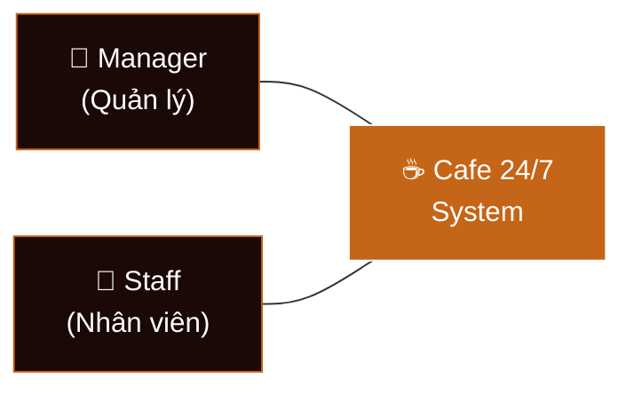
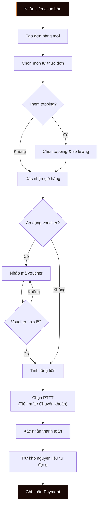
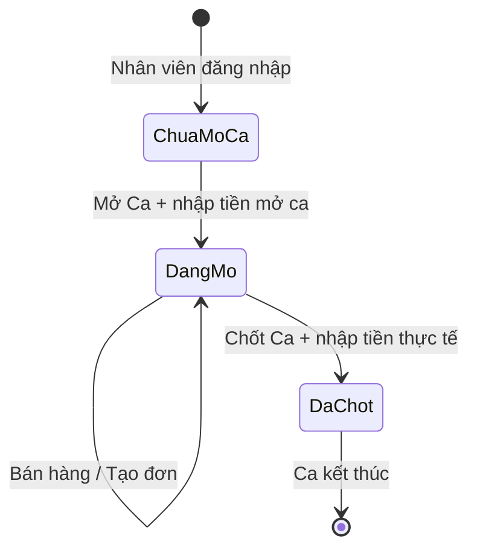
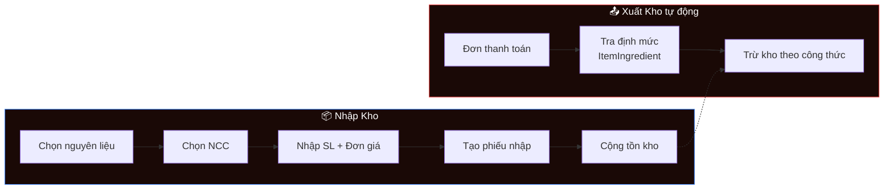
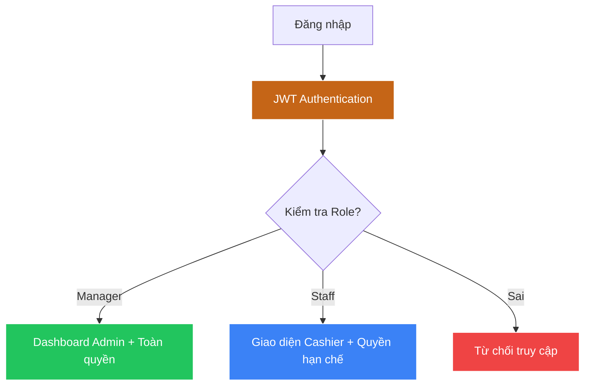

# 📋 Phân Tích Nghiệp Vụ - Hệ Thống Quản Lý Quán Cafe 24/7

## 1. Giới thiệu dự án

### 1.1. Bối cảnh & Vấn đề
Quán cafe truyền thống gặp nhiều khó khăn trong vận hành: ghi đơn thủ công dễ sai sót, theo dõi tồn kho không chính xác, báo cáo doanh thu cuối ngày mất thời gian, quản lý ca làm việc nhân viên thiếu minh bạch. Hệ thống **Cafe 24/7** được xây dựng nhằm số hóa toàn bộ quy trình vận hành quán cafe.

### 1.2. Phạm vi hệ thống
| Phạm vi | Mô tả |
|---------|-------|
| **Trong phạm vi** | Quản lý đơn hàng, thực đơn, kho nguyên liệu, nhân viên, ca làm việc, nhà cung cấp, mã giảm giá, báo cáo doanh thu |
| **Ngoài phạm vi** | Đặt hàng online, tích hợp giao hàng, CRM khách hàng nâng cao, kế toán thuế |

### 1.3. Đối tượng sử dụng (Actors)



| Actor | Vai trò | Quyền hạn chính |
|-------|---------|-----------------|
| **Manager** | Quản lý quán | Toàn quyền: CRUD thực đơn, kho hàng, nhân viên, nhà cung cấp, voucher, xem báo cáo tháng, cài đặt hệ thống |
| **Staff** | Nhân viên thu ngân | Bán hàng, mở/chốt ca, xuất kho nguyên liệu, xem báo cáo ca cá nhân |

---

## 2. Các Module Nghiệp Vụ Chính

### 2.1. Module Quản Lý Đơn Hàng (Order Management)

**Mô tả**: Cho phép nhân viên tạo đơn, thêm món, áp dụng mã giảm giá và thanh toán.

**Quy trình nghiệp vụ**:



**Công thức tính tiền**:
- `Subtotal = Σ(Item.BasePrice × Quantity) + Σ(Topping.Price × Quantity)`
- `Discount = Voucher.DiscountAmount` (nếu có)
- `VAT = (Subtotal - Discount) × 8%`
- `GrandTotal = Subtotal - Discount + VAT`

### 2.2. Module Quản Lý Ca Làm Việc (Shift Management)

**Mô tả**: Hệ thống ca làm việc cho phép nhân viên mở ca đầu ngày và chốt ca cuối ca, đảm bảo minh bạch doanh thu.



**Luồng xử lý**:
1. Nhân viên bấm **Mở Ca** → nhập số tiền quỹ mở ca (`Opening`)
2. Trong ca: nhân viên thực hiện bán hàng bình thường
3. Cuối ca: bấm **Chốt Ca** → nhập số tiền thực tế thu được (`Expected`)
4. Hệ thống so sánh: `Thực tế - Lý thuyết = Chênh lệch`
5. SignalR broadcast sự kiện → tất cả trạm cashier đều cập nhật

### 2.3. Module Quản Lý Kho Hàng (Inventory Management)

**Mô tả**: Quản lý nguyên liệu, nhập hàng từ nhà cung cấp, tự động trừ kho khi bán.



**Công thức trừ kho**:
```
Với mỗi OrderDetail:
  Ingredients = ItemIngredient.Where(ItemId == detail.ItemId)
  Foreach ingredient:
    DeductQty = detail.Quantity × ingredient.Quantity
    ingredient.StockQty -= DeductQty
```

### 2.4. Module Quản Lý Thực Đơn (Menu Management)

| Chức năng | Mô tả |
|-----------|-------|
| CRUD Danh mục | Tạo/sửa/xóa danh mục (Cà phê, Trà, Bánh...) |
| CRUD Món | Tạo/sửa/xóa món với tên, giá, ảnh, danh mục |
| Quản lý Topping | Thêm topping (trân châu, thạch, kem...) |
| Upload ảnh | Async upload → Cloudinary → lưu URL |

### 2.5. Module Báo Cáo (Reporting)

| Loại báo cáo | Dữ liệu | Người xem |
|--------------|----------|-----------|
| Doanh thu ca | Tiền mặt, chuyển khoản, đơn hủy, tổng | Staff, Manager |
| Doanh thu theo buổi | Sáng/Chiều/Tối phân theo giờ mở ca | Staff, Manager |
| Doanh thu theo NV | Xếp hạng nhân viên theo doanh thu chốt ca | Staff, Manager |
| Báo cáo tháng | Doanh thu, chi phí nhập, lợi nhuận, trend | Manager |

### 2.6. Module Phân Quyền (Authorization)



### 2.7. Module Mã Giảm Giá (Voucher)

**Quy tắc nghiệp vụ**:
- Mỗi voucher có `Code`, `DiscountAmount`, `ExpiryDate`
- Có thể giới hạn theo danh mục (`ApplicableCategoryId`)
- Voucher hết hạn → không áp dụng được
- Mỗi đơn chỉ áp dụng 1 voucher

---

## 3. Ma Trận CRUD Theo Actor

| Thực thể | Manager | Staff |
|----------|---------|-------|
| User | CRUD | R (bản thân) |
| Category | CRUD | R |
| Item | CRUD | R |
| Topping | CRUD | R |
| Order | R (tất cả) | CR (của mình) |
| Payment | R | C |
| Shift | R (tất cả) | CR (của mình) |
| Ingredient | CRUD | R |
| Import | CRUD | — |
| Supplier | CRUD | — |
| Voucher | CRUD | R |
| SystemConfig | RU | — |
| SystemActivityLog | R | — |
| Expense | CRUD | — |

---

## 4. Yêu Cầu Phi Chức Năng

| Yêu cầu | Giải pháp |
|----------|-----------|
| **Bảo mật** | JWT authentication, password hash BCrypt, role-based authorization |
| **Hiệu năng** | Lazy loading EF Core, client-side caching, pagination |
| **Thời gian thực** | SignalR WebSocket cho đồng bộ ca làm việc |
| **Responsive** | CSS responsive design, hỗ trợ mobile/tablet |
| **Dữ liệu** | SQL Server, Code First migrations, decimal(18,2) cho tiền tệ |
