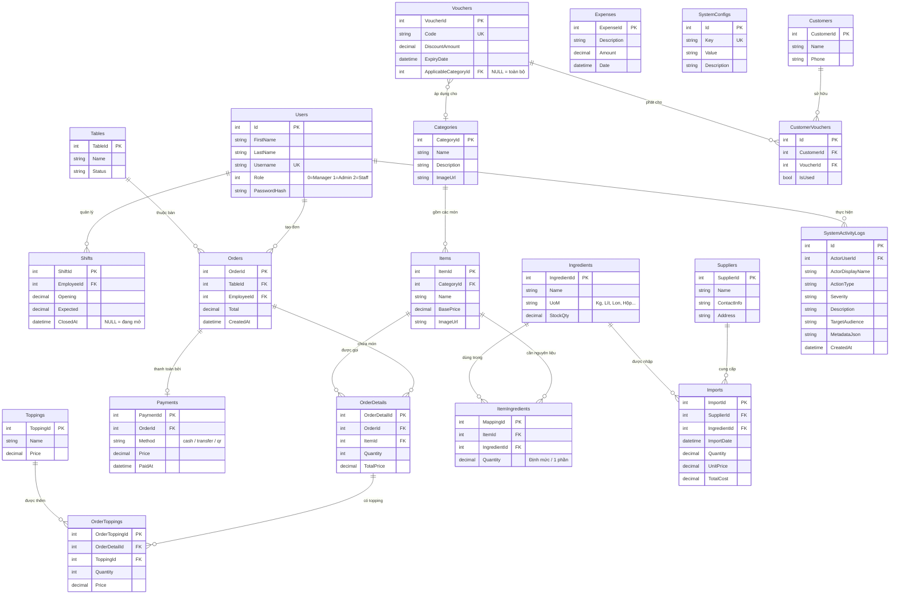

# 🗄️ Thiết Kế Cơ Sở Dữ Liệu — Cafe 24/7

## 1. Entity-Relationship Diagram (ERD)

---

## 2. Danh Sách Bảng Dữ Liệu

| # | Bảng | Mô tả | Số cột |
|---|------|-------|--------|
| 1 | `Users` | Tài khoản người dùng (Manager, Staff) | 6 |
| 2 | `Shifts` | Ca làm việc | 5 |
| 3 | `Tables` | Bàn trong quán | 3 |
| 4 | `Orders` | Đơn hàng | 5 |
| 5 | `OrderDetails` | Chi tiết đơn (dòng món) | 5 |
| 6 | `OrderToppings` | Topping theo dòng đơn | 5 |
| 7 | `Payments` | Thanh toán | 5 |
| 8 | `Categories` | Danh mục thực đơn | 4 |
| 9 | `Items` | Món ăn / đồ uống | 5 |
| 10 | `Toppings` | Topping | 3 |
| 11 | `Ingredients` | Nguyên liệu kho | 4 |
| 12 | `ItemIngredients` | Định mức nguyên liệu/món | 4 |
| 13 | `Suppliers` | Nhà cung cấp | 4 |
| 14 | `Imports` | Phiếu nhập kho | 7 |
| 15 | `Vouchers` | Mã giảm giá | 5 |
| 16 | `Customers` | Khách hàng | 3 |
| 17 | `CustomerVouchers` | Voucher phát cho khách | 4 |
| 18 | `Expenses` | Chi phí vận hành | 4 |
| 19 | `SystemConfigs` | Cấu hình hệ thống | 4 |
| 20 | `SystemActivityLogs` | Nhật ký hoạt động | 9 |
| 21 | `Employees` | Nhân viên (mở rộng) | — |

**Tổng: 21 bảng**

---

## 3. Mô Tả Chi Tiết Các Quan Hệ

### 3.1. Quan hệ One-to-Many (1:N)

| Bảng cha | Bảng con | Mô tả |
|----------|----------|-------|
| `Users` | `Shifts` | 1 nhân viên có nhiều ca |
| `Users` | `Orders` | 1 nhân viên tạo nhiều đơn |
| `Tables` | `Orders` | 1 bàn có nhiều đơn (theo thời gian) |
| `Orders` | `OrderDetails` | 1 đơn có nhiều dòng chi tiết |
| `OrderDetails` | `OrderToppings` | 1 dòng có nhiều topping |
| `Categories` | `Items` | 1 danh mục có nhiều món |
| `Suppliers` | `Imports` | 1 NCC cung cấp nhiều lần |
| `Ingredients` | `Imports` | 1 nguyên liệu được nhập nhiều lần |

### 3.2. Quan hệ Many-to-Many (M:N)

| Bảng A | Bảng trung gian | Bảng B | Mô tả |
|--------|-----------------|--------|-------|
| `Items` | `ItemIngredients` | `Ingredients` | Định mức nguyên liệu |
| `Customers` | `CustomerVouchers` | `Vouchers` | Voucher đã phát |

### 3.3. Quan hệ One-to-One (1:1)

| Bảng A | Bảng B | Mô tả |
|--------|--------|-------|
| `Orders` | `Payments` | 1 đơn → tối đa 1 lần thanh toán |

---

## 4. Kiểu Dữ Liệu Đặc Biệt

| Kiểu | Sử dụng | Lý do |
|------|---------|-------|
| `decimal(18,2)` | Tất cả cột tiền tệ (`Price`, `Total`, `Opening`, `Expected`, `StockQty`) | Tránh lỗi floating-point với tiền VND |
| `DateTime?` (nullable) | `Shift.ClosedAt` | `NULL` = ca đang mở, có giá trị = đã chốt |
| `int?` (nullable) | `Voucher.ApplicableCategoryId` | `NULL` = áp dụng toàn bộ menu |
| `nvarchar` | Tất cả chuỗi | Hỗ trợ Unicode tiếng Việt |
