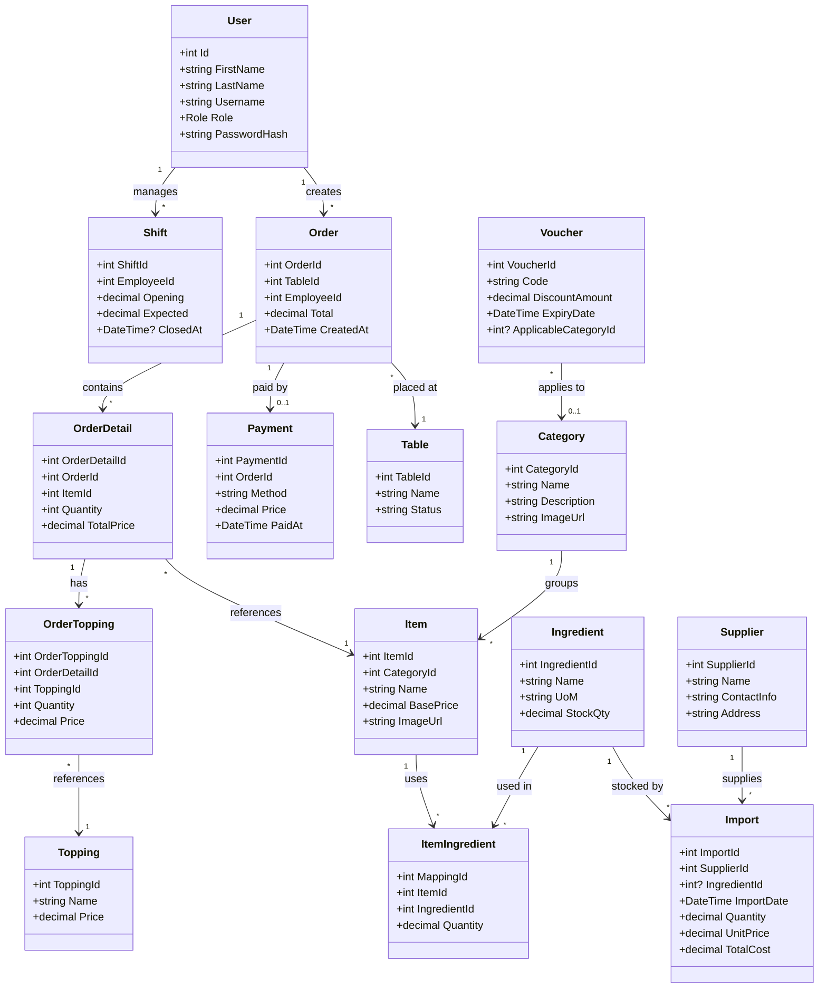
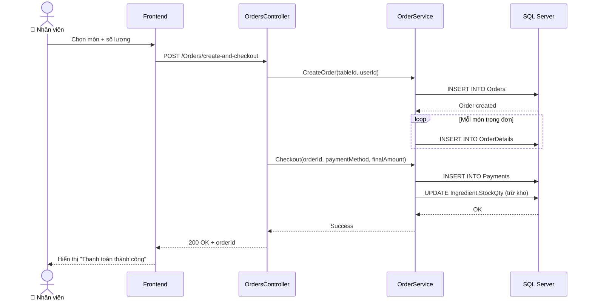
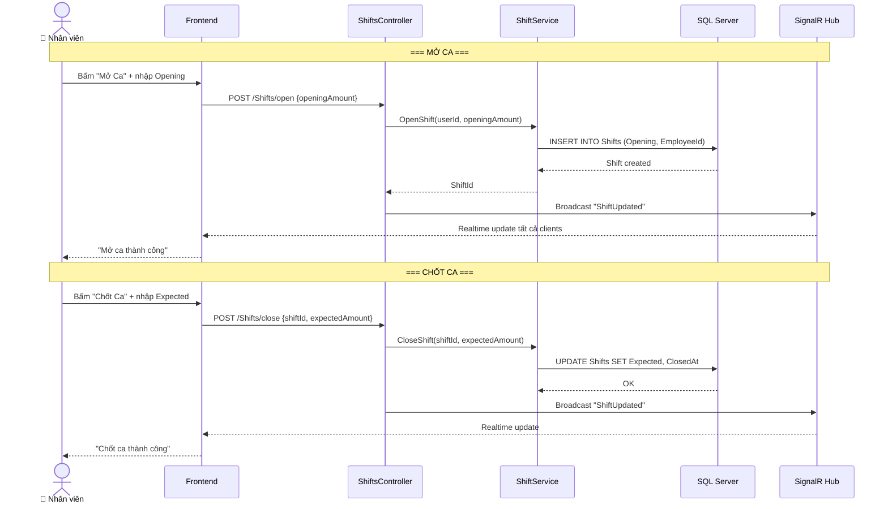
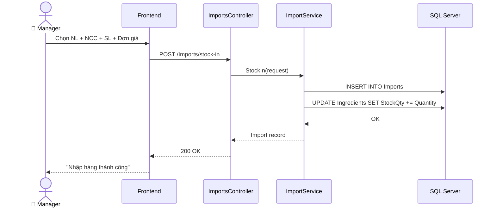
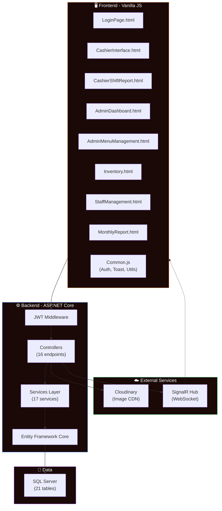
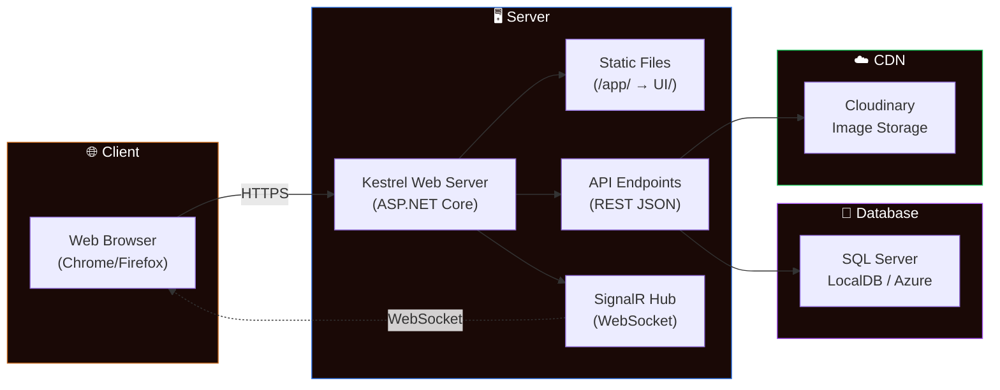

# 📐 Sơ Đồ UML - Hệ Thống Cafe 24/7

## 1. Use Case Diagram

```mermaid
graph TB
    subgraph System["☕ Hệ Thống Cafe 24/7"]

        UC1["Đăng nhập / Đăng xuất"]
        UC2["Quản lý thực đơn"]
        UC3["Tạo & thanh toán đơn hàng"]
        UC4["Mở / Chốt ca làm việc"]
        UC5["Quản lý kho nguyên liệu"]
        UC6["Nhập hàng từ NCC"]
        UC7["Quản lý nhân viên"]
        UC8["Quản lý nhà cung cấp"]
        UC9["Quản lý mã giảm giá"]
        UC10["Xem báo cáo doanh thu ca"]
        UC11["Xem báo cáo tháng"]
        UC12["Xuất kho nguyên liệu"]
        UC13["Cài đặt hệ thống"]
        UC14["Xem nhật ký hoạt động"]
    end

    Manager["👤 Manager"]
    Staff["👤 Staff"]

    Manager --> UC1
    Manager --> UC2
    Manager --> UC3
    Manager --> UC4
    Manager --> UC5
    Manager --> UC6
    Manager --> UC7
    Manager --> UC8
    Manager --> UC9
    Manager --> UC10
    Manager --> UC11
    Manager --> UC13
    Manager --> UC14

    Staff --> UC1
    Staff --> UC3
    Staff --> UC4
    Staff --> UC10
    Staff --> UC12

    style System fill:#1a0906,stroke:#c56517,color:#fff
    style Manager fill:#c56517,stroke:#fff,color:#fff
    style Staff fill:#3b82f6,stroke:#fff,color:#fff
```

---

## 2. Class Diagram (Entity Relationship)

---

## 3. Sequence Diagram — Tạo Đơn & Thanh Toán

---

## 4. Sequence Diagram — Mở Ca & Chốt Ca

---

## 5. Sequence Diagram — Nhập Kho

---

## 6. Component Diagram

---

## 7. Deployment Diagram

